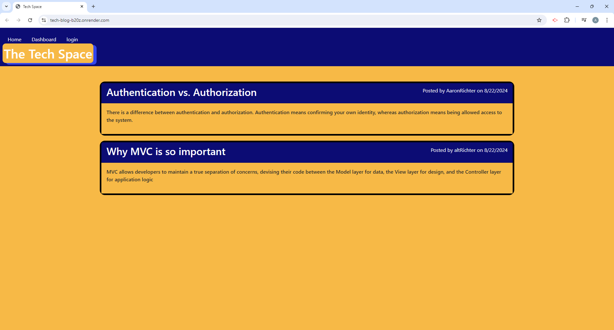
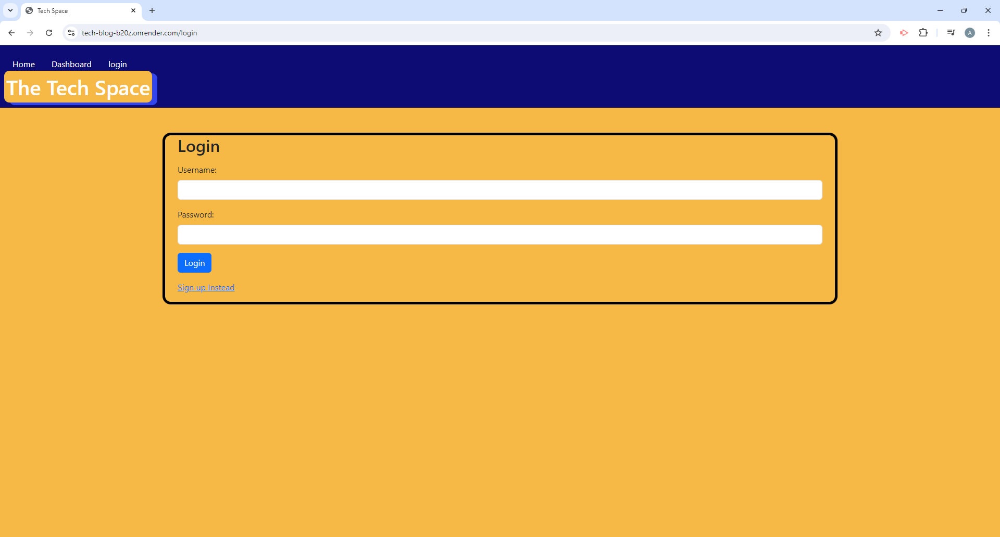
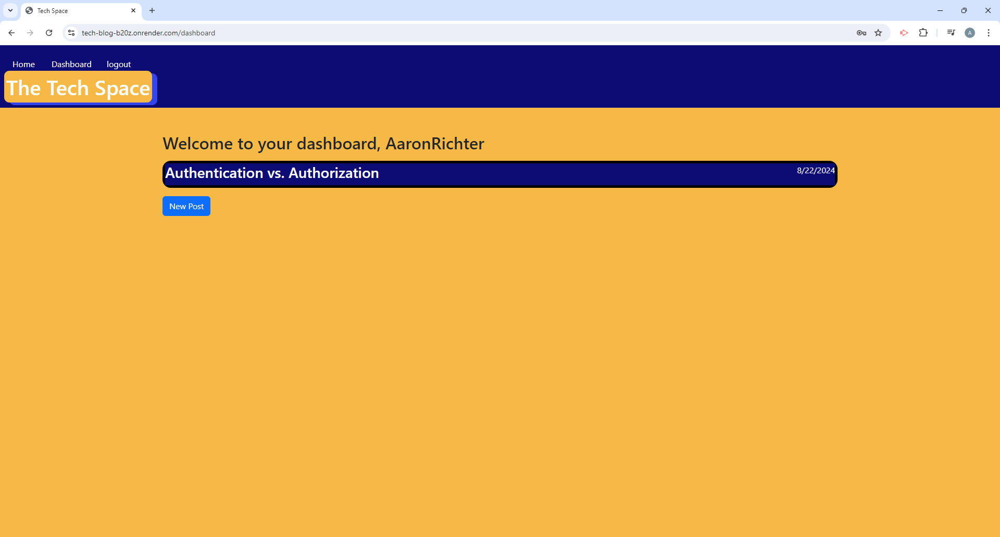
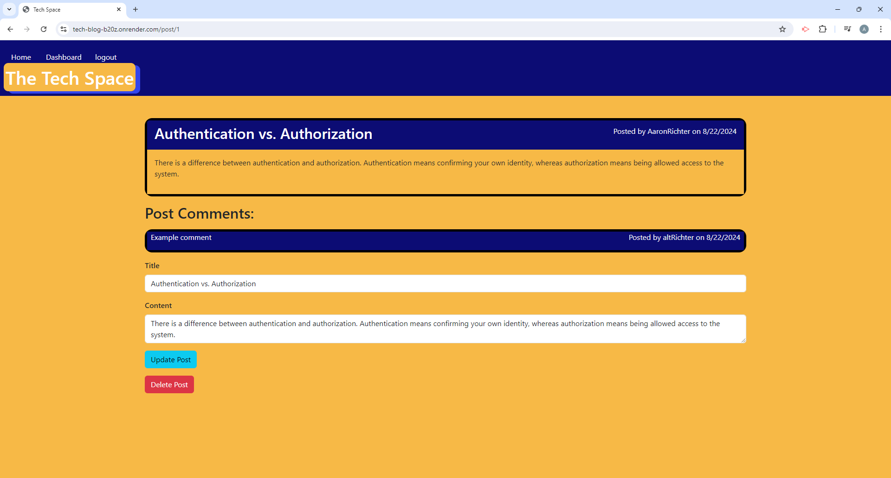
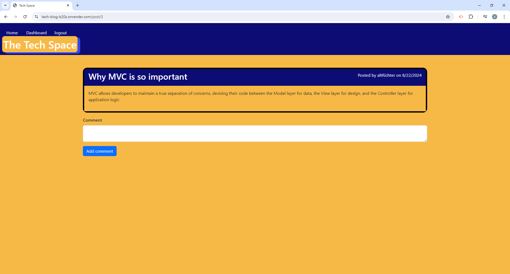

# tech-blog

## Description

The goal for this application was to create a CMS-style blog site where me and fellow developers could publish blog posts about new technical concepts, recent advancments, and new technologies. The blog site will also allow a user to write comments about the posts left by other users. The blog site follows the MVC paradigm, use handlebars as the templating engine, and uses postgreSQL as the database management system and sequelize as the ORM.

## Installation

If you are using the application through the url from render then all setup will be handled by Render. If you are forking the github repository you will need to fill out the .env.EXAMPLE file with your postgreSQL username and password and change the file name to .env to get the application to work.

## Usage

Below are screenshots showing the homepage of the application as well as the login page, an example user dashboard, and example pages of updating a post and leaving a comment on a post.

## Credits

N/A

## License

N/A

## Contribute

N/A

## Links

[Render URL](https://tech-blog-b20z.onrender.com/)
